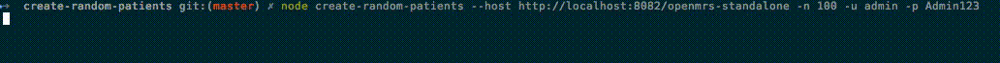

# Create Random Patients

> Creates `n` random patients using `openmrs.js`

<p align="center">
  
</p>

:warning: **This will most likely only work with the Reference Application.**

## Prerequisites

You will need git and Node.js [installed](https://nodejs.org/en/download/package-manager/)
(tested with v5).

## Download

Clone the repo:

```sh
git clone https://github.com/psbrandt/openmrs.js.git
```

Navigate to this example:

```sh
cd openmrs.js/examples/node/create-random-patients

```

## Install Dependencies

Run:

```sh
npm install
```

## Usage

```
create-random-patients [args]

Options:
  -n, --number  Number of patients to create                          [required]
  -u, --user    OpenMRS username                                      [required]
  -p, --pass    OpenMRS password                                      [required]
  -h, --host    OpenMRS application URL                               [required]
  --help        Show help                                              [boolean]

Examples:
  create-random-patients -n 5 -u admin -p   Create 5 patients
  Admin123 -h
  http://localhost:8080/openmrs
```

Example:

```sh
node create-random-patients --host http://localhost:8082/openmrs-standalone -n 10 -u admin -p Admin123
```

## Troubleshooting

Are you using the Reference Application? If not, download the standalone [here](https://sourceforge.net/projects/openmrs/files/releases/OpenMRS_2.3.1/openmrs-standalone-2.3.1.zip/download)
and use that instead.

### Something About <kbd>Access-Control-Allow-Origin</kbd>

Read the **HTTP access control (CORS)** section [here](https://github.com/psbrandt/openmrs-contrib-apidocs/tree/swagger-ui#http-access-control-cors).
